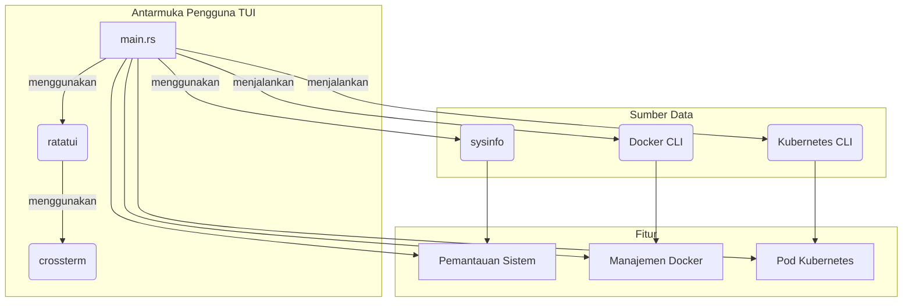
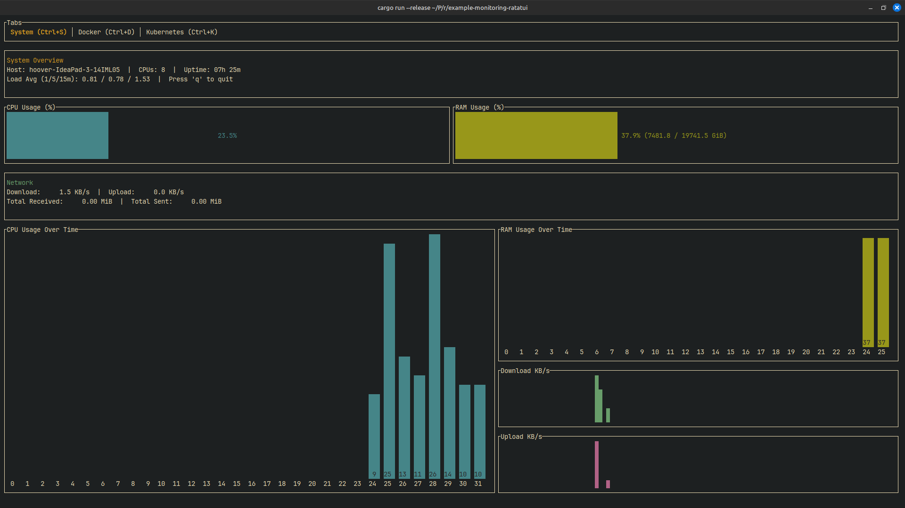

## Example Monitoring Ratatui

### Ringkasan Proyek

Proyek ini adalah alat pemantauan berbasis terminal (TUI) yang ditulis dalam bahasa Rust menggunakan pustaka `ratatui`. Aplikasi ini menyediakan antarmuka untuk memantau:

*   **Sistem:** Penggunaan CPU, RAM, lalu lintas jaringan, beban sistem, dan waktu aktif.
*   **Docker:** Menampilkan daftar kontainer dan gambar Docker, statusnya, dan memungkinkan manajemen dasar (memulai, menghentikan, memulai ulang, menghapus). Ada juga fitur untuk membuat kontainer baru.
*   **Kubernetes:** Menampilkan daftar pod Kubernetes beserta statusnya, dan memungkinkan untuk menghapus pod.

### Arsitektur

Aplikasi ini adalah biner tunggal yang menggunakan beberapa pustaka untuk mengambil dan menampilkan informasi:

*   `ratatui`: Untuk membangun antarmuka pengguna berbasis teks (TUI).
*   `crossterm`: Sebagai backend untuk `ratatui` untuk mengontrol terminal.
*   `sysinfo`: Untuk mendapatkan informasi sistem seperti CPU, memori, dan statistik jaringan.
*   `chrono`: Untuk operasi terkait waktu.
*   Aplikasi ini menjalankan perintah `docker` dan `kubectl` di shell untuk mendapatkan informasi dari Docker dan Kubernetes.

Berikut adalah diagram arsitektur menggunakan Mermaid.js:



### Cara Menjalankan Secara Lokal

1.  **Prasyarat:**
    *   Instal Rust: [https://www.rust-lang.org/tools/install](https://www.rust-lang.org/tools/install)
    *   Instal Docker (opsional, untuk pemantauan Docker): [https://docs.docker.com/get-docker/](https://docs.docker.com/get-docker/)
    *   Instal kubectl (opsional, untuk pemantauan Kubernetes): [https://kubernetes.io/docs/tasks/tools/](https://kubernetes.io/docs/tasks/tools/)

2.  **Klon Repositori:**
    Anda perlu mengkloning repositori proyek ini terlebih dahulu.
    ```bash
    git clone https://github.com/MamangRust/example-monitoring-ratatui.git
    cd example-monitoring-ratatui
    ```

3.  **Jalankan Aplikasi:**
    Gunakan Cargo, manajer paket Rust, untuk membangun dan menjalankan proyek.
    ```bash
    cargo run
    ```

Aplikasi akan berjalan di terminal Anda. Anda dapat menavigasi antar tab dengan menekan `Ctrl+S` (Sistem), `Ctrl+D` (Docker), dan `Ctrl+K` (Kubernetes). Untuk keluar dari aplikasi, tekan `q`.


## Demo

---
