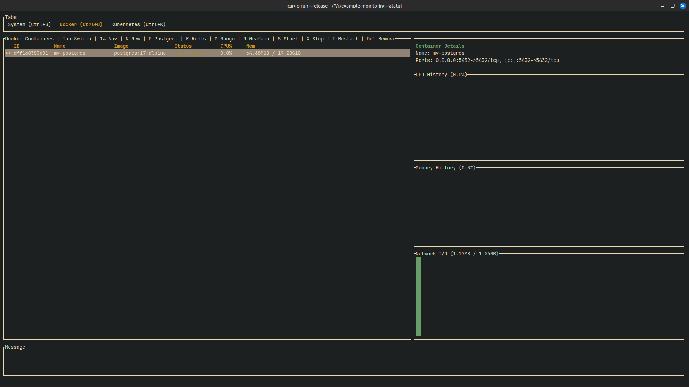

## Example Monitoring In Ratatui

### Project Overview

This project is a terminal-based monitoring tool (TUI) written in Rust using the `ratatui` library. This application provides an interface for monitoring:

*   **System:** CPU usage, RAM, network traffic, system load, and uptime.
*   **Docker:** Displays a list of Docker containers and images, their status, and allows basic management (start, stop, restart, delete). There is also a feature to create new containers.
*   **Kubernetes:** Displays a list of Kubernetes pods along with their status, and allows for deleting pods.

### Architecture

This application is a single binary that uses several libraries to retrieve and display information:

*   `ratatui`: To build the text-based user interface (TUI).
*   `crossterm`: As a backend for `ratatui` to control the terminal.
*   `sysinfo`: To get system information such as CPU, memory, and network statistics.
*   `chrono`: For time-related operations.
*   This application runs `docker` and `kubectl` commands in the shell to get information from Docker and Kubernetes.

Here is the architecture diagram using Mermaid.js:


### How to Run Locally

1.  **Prerequisites:**
    *   Install Rust: [https://www.rust-lang.org/tools/install](https://www.rust-lang.org/tools/install)
    *   Install Docker (optional, for Docker monitoring): [https://docs.docker.com/get-docker/](https://docs.docker.com/get-docker/)
    *   Install kubectl (optional, for Kubernetes monitoring): [https://kubernetes.io/docs/tasks/tools/](https://kubernetes.io/docs/tasks/tools/)

2.  **Clone the Repository:**
    You need to clone this project repository first.
    ```bash
    git clone https://github.com/MamangRust/example-monitoring-ratatui.git
    cd example-monitoring-ratatui
    ```

3.  **Run the Application:**
    Use Cargo, the Rust package manager, to build and run the project.
    ```bash
    cargo run
    ```

The application will run in your terminal. You can navigate between tabs by pressing `Ctrl+S` (System), `Ctrl+D` (Docker), and `Ctrl+K` (Kubernetes). To exit the application, press `q`.


## Demo

---

